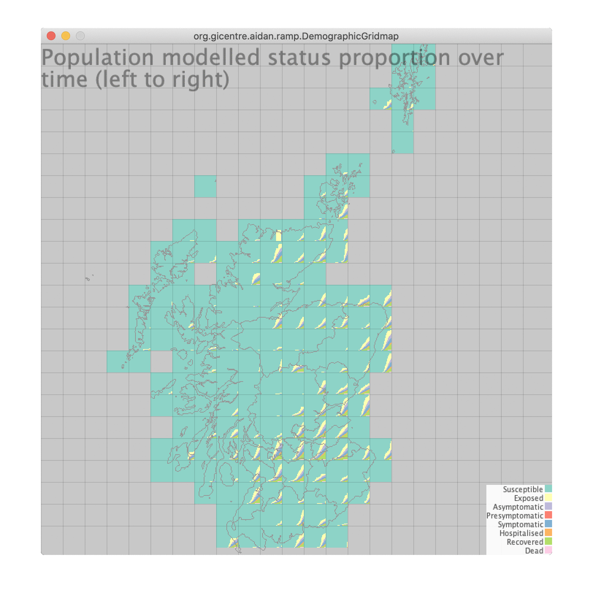

# Meeting (and non-meeting) notes 


## 4th June 2021 (meeting)

### Pre-meeting

I had agreed to do some difference-comparison views as currently you can only switch between views. This can be useful (see below - click to enlarge). This is between the most recent two pollution runs.



However, directly-encoding difference will enable more nuanced comparions. But, it is difficult something based on the stacked bars, because some categories will increase and some will decrease, so it needs to be an unstacked version.

Here's one that combines age groups:


Seems surprisingly hard to interpret! The temporal structure we saw above is visible but not easy to see.

To discuss in the meeting! Latest release [here](https://github.com/aidans/ramp/releases/tag/RAMP_DemographicGridmap-v1.6).


## 7th May 2021 (meeting)

Claire has provided two model run results for different pollution sensitivities (same PM10 pollution levels based on real data, but different effects on the respiratory system). Both these work in the [most recent version of the software](https://github.com/aidans/ramp/releases/tag/RAMP_DemographicGridmap-v1.5) using command line `java -jar DemographicGridmap.jar demographics_file=data/2021-04-09_data/d298197ad0b8e2cc54836908da511de7fe1c9877.h5 results_file=data/2021-04-30_pollution/abundances_poll1.h5 baseline_results_file=data/2021-04-30_pollution/abundances_poll2.h5`, which currently just lets you switch between "baseline" and "results"

As has been the intention for a long term, Aidan would like to do explicit direct visual encoding of comparisons.

We also talked at a higher level of what we want to do. Richard said that the main question remains "are we doing better in one scenario or another?" and "how to make this apparent" where the complication is how we understand "better". Is it death rates overall or ensuring that no sociodemographic groups are more disadvantaged than others. He also talked about "multicriteria optimisation" being an open problem to which as far as he knows, there is no satisfactory solutions. He recognises the role of visualisation to help determine this.

There's still a distinction between:

 - studying model outputs
 - studying different scenarios
 
The modelling is still firmly in the first camp.

We also talked about how this could apply to plant ecology models.

### Next steps

Next steps are to look at variability between stochastic modelling outputs. We also talked about potentially coarsening up the spatial model output to reduce data sizes. This will need the demographic data to also be coarsened to work with the visualisation as it currently stands.

 - [ ] Claire to produce multiple model stochastic outputs (same input parameters) (maybe 10 runs?)
 - [ ] Aidan to design some specific comparison views.


## 30th April 2021 (update)

Claire's new model results (in the [`data2021-04-26_pollution`](https://github.com/aidans/ramp/tree/main/data/2021-04-26_pollution) folder of this repo; pollution data from [here](https://data.scrc.uk/object/41176)) looks like things are in the right place. Claire please check!

<table width="100%">
<tr>
<td></td>
<td>Pollution run</td>
</tr>
<tr>
<td></td>
<td>Pollution run</td>
</tr>
</table>

Most recent version of the software is [here](https://github.com/aidans/ramp/releases/tag/RAMP_DemographicGridmap-v1.5).

Just need some more results now to work on comparisons.


## 29th April 2021 (meeting)

Claire has sent the updated model results (with pollution) and corrected locations. The pollution data are [here](https://data.scrc.uk/object/41176). Aidan hasn't had chance to look at these, but will soon.

*Claire* has publicly released the model in Julia on GitHub and is working on a paper about it. It's currently the version that only works for plants, but the updates that make it work for COVID modelling will come in the next iteration.

*Aidan* will be applying for a mini-project to try to get he gridding working in JavaScript so it can (hopefully) be embedded in the generic tool eventually.

*Richard* reported that the Java API for the data pipeline was being worked on, but proving tricky. Aidan is using the native netCDR Java library and will send to Richard.


- [X] Aidan to send NetCDF Java library details to Richard.

## 16th April 2021 (meeting)

### Progress updates

Aidan hasn't been able to get to the bottom of the apparent mismatched grid squares. Has asked Claire to try and plot the data to check.

Claire made some progress towards modelling with different levels of atmospheric pollution, but outputs aren't ready yet. These should be more subtle patterns that will needs good comparison visualisation.

### Ideas

 - Aidan: could try and calibrate the models on the data between old/new variants and the different types of lockdown.
 

- [ ] Claire to check spatial references in model files

## 12th April 2021 (another update)

The problem seems to be caused by [some grid references](unmatched_locations_model.txt) in the model output file not being present in the demographics file.

- [ ] Claire to check

## 12th April 2021 (update)

Aidan has adapted his code to work with the new formats.

However the disease is affecting populations outside the central belt (which we were not expecting). Either a problem with the visualisation of the model output. Since the demographics looks to be in the right place, and the model outputs are directly linked to these, Aidan thinks the visualisation is fine.

<table width="100%">
<tr>
<td></td>
<td>Demographics</td>
</tr>
<tr>
<td></td>
<td>Disease at day 40 is outside the Central Belt (unexpected)</td>
</tr>
<tr>
<td></td>
<td>Disease at day 40 is outside the Central Belt (unexpected)</td>
</tr>
</table>


- [ ] Claire to check outputs

## 9th April 2021 (meeting)

### Aidan's progress updates

 - Confirmed he'd received [updated files with the updated file format](https://github.com/aidans/ramp/blob/main/data/2021-04-09_data/Claire%20Harris%20-%20commuting_comparison.zip) (with OS grid refs) but hadn't had chance to adapt the code to  work with it]

### Claire's progress reports

 - No specific progress (mainly waiting on Aidan)

### Discussion

Aidan noted that the two model outputs (with and without commuting) weren't the best examples for comparison, because they were very different. Claire to think of more more  subtle examples. Would like to try pollutant levels.

Claire has been refactoring her code so it works with other environmental models. Aidan wants to try and ensure that the visualisation will work with any model output and suggests that we all keep this in mind

- [ ] Aidan to adapt code to work with new files
- [ ] Claire to do some model runs that differ in more subtle ways

## 26th March 2021 (meeting)

### Premeeting

Aidan wishes to:

 - reiterate his desire for the visualisation to support the modelling process (not just outputs)
 - possibility of making it a general tool (for Claire's model in general)
 - update on plans for epi paper

### More data

Claire to provid new model output files reflecting the new demographics format (see below) that use OS gridrefs via dropbox

## 11th March 2021 (meeting)

Claire, Richard and Aidan met to discuss to discuss any updates.

No updates from Richard or Aidan.

Claire investigated the problem with the mismatched cells and found that Aidan was using an old version and she was using a newer but not the [newest version](https://data.scrc.uk/data_product/SCRC:human/demographics/population/scotland@1.0.2)!

- [ ] Claire to send new model runs to Aidan
- [ ] Aidan to make this work with the new files
- [ ] Aidan to do some direct comparison visual encodings.

Richard mentioned that Helen Brown (Edinburgh; statistics) is experimenting with grid maps, perhaps Aidan to talk to her?

Richard also mentioned that we might need to move on this epidemiology paper if we're going for it.

## 5th March 2021 (meeting)

Claire, Richard and Aidan met to discuss to discuss any updates.

No updates from last time. Actions still ongoing.

We discussed a bit more about how some of these ideas can be applied to various ecology problems.


## 25th February 2021 (meeting)

Claire and Aidan met to discuss the comparisons and issue raised yesterday (the entry below).

### Problem: Mismatched squares

Claire noted that the grid square format has changed since the original `demographics.h5` (the one I'm using), a more recent one (that she's using) and an even more recent one that neither of us are using.

 - [ ] Claire to check the format and geographical bounding box
 - [ ] Claire to regenerate her model results with the first `demographics.h5` and see it they load OK.
 

### Idea: Commuting

Claire will eventually use real OD data, but will run some examples with limited flows to help work out what the model is doing. She will provide her ODs which could be incorporated

We also discussed the idea of doing comparisons between different degrees of influence of commuting on the spread the virus

 - [ ] Claire to do this


### Idea: Different strains
 
Claire said they are thinking of modelling multiple strains of the virus - for future work.


### Paper idea: OD maps for similarity

Aidan reminded us that we would try and go for a paper in the July Special Issue on potential for OD maps to help understand population similarity.


## 24th February 2021 (non-meeting update)

On 19th Feb, Claire sent two results set - with and with commuting data. These are at `../data/2021-02-19_comparison.zip`. We want to do a comparison of these. (Note that these use fake commuting data: @Claire: see the entry below for where to get OD commuting data at OA level.

 - [ ] Claire to see 12th Feb entry below for where to get real OD data (from the 2011 census)

As a precursor to proper comparison, [RAMP_DemographicGridmap-v1.4](https://github.com/aidans/ramp/releases/tag/RAMP_DemographicGridmap-v1.4) loads a *result set* and a *baseline result set* and you can switch between them (currently with the 'b' key).

<table width="100%">
<tr>
<td></td>
<td>Results with commuting, over time</td>
</tr>
<tr>
<td></td>
<td>Results without commuting data, over time</td>
</tr>
</table>


There is an apparent *problem* in which the grid cells don't seem to match up with those from the demographics data. These are matched with the `/grid1km/1year/persons/Dimension_1_names` dataset in `demographics.h5` (in `../data/demographics.zip`) and the `/abundances/grid_id` dataset in the `h5` files in ``../data/2021-02-19_comparison.zip`. @Claire can you check?

 - [ ] Claire, please check the location grid ids (see above)

<table width="100%">
<tr>
<td></td>
<td>The data don't get as far as the east coast, so don't match that from demographics.h5 Please check (details above!)</td>
</tr>
</table>


 - [ ] Claire/Richard, run [RAMP_DemographicGridmap-v1.4](https://github.com/aidans/ramp/releases/tag/RAMP_DemographicGridmap-v1.4)
 - [ ] Aidan to do some thinking about comparison

## 22th February 2021 (non-meeting update)

I was able to get OD commuter data for whole UK - from which I extracted Scotland - from the "WF01BUK" table from http://wicid.ukdataservice.ac.uk/cider/wicid/downloads.php from the "2011 Census United Kingdom - Safeguarded section".
 
<table width="100%">
<tr>
<td></td>
<td>OD map of commuting (home-work), using a logarithmic colour scaling. Outline colour indicates total number of origin (home) flows.</td>
</tr>
<tr>
<td></td>
<td>DO map of commuting (work-home).  Outline colour indicates total number of destination (work) flows.</td>
</tr>
</table>


## 12th February 2021 

Aidan and Claire met to talk about next steps. Claire is currently merging the COVID model code back into the original ecological model. Aidan likes the potential that some of the work we do could also be used in an ecological/biodivesity context.

It would be nice to write a paper about OD maps for assessing geographical similarity. Aidan's suggestions are:

- a [Visualization in Environmental Sciences](https://www.dropbox.com/s/mbeq1qorwa37777/CfP_C%26G_VisualisationInEnvironmentalSciences.pdf?dl=0) Special Issue in Computers & Graphics. Deadline:  30th July
- The [EnvirVis workshop](https://www.informatik.uni-leipzig.de/bsv/envirvis2021/). Deadline: 5th March

We also agreed that we would turn our focus to work on *model output comparisons*. One of the model parameters is the relative contributions of *spatial spread vs commuting*. Claire said that it is really difficult to assess the differences with such a high-resolution spatial model. We agreed to start to do some model comparisons to *directly inform model development*.

### Actions:
 - [ ] Richard and Claire: play with [SimilarityODMap-v1.3](https://github.com/aidans/ramp/releases/tag/SimilarityODMap-v1.3) and maybe start to think about a paper output (see above suggestions)
 - [ ] Claire to provide a couple of model outputs for comparison


## 29th January 2021 

Had a call with Richard where we experimented with variants of the Kullback–Leibler Divergence formula from [his paper](https://arxiv.org/abs/1404.6520).

We also adapted the code to distance-weight the counts in other categories, controlled by the `p` parameter. Its an asymmetrical measure.

```
	public static double modifiedKLDivergence(double[] ns2, double[] ns1){
		double klDiv = 0;
		double p=0.001;

		double ns1Sum=0,ns2Sum=0;
		for (double n1:ns1)
			ns1Sum+=n1;
		for (double n2:ns2)
			ns2Sum+=n2;
		double nsSum=ns1Sum+ns2Sum; //sum of both ns1 ns2 

		for (int i = 0; i<ns1.length; i++) {
			double zns1=0,zns=0; 
			for (int j = 0; j<ns1.length; j++) {
				zns1+=Math.pow(p,Math.abs(i-j))*ns1[j];
				zns+=Math.pow(p,Math.abs(i-j))*(ns1[j]+ns2[j]);
			}
			if (ns1[i]>0) {
		        klDiv += (ns1[i]/ns1Sum) * Math.log( (zns1/nsSum) / (zns/(float)nsSum));
//				klDiv += (ns1[i]/ns1Sum) * Math.log( (ns1[i]/ns1Sum) / ((ns1[i]/ns1Sum)+(ns2[i]/ns2Sum)));
//				klDiv -= (ns1[i]/ns1Sum) * Math.log( (ns1[i]/ns1Sum) / ((ns1[i]+ns2[i])/(float)nsSum));
			}
		}
		return Math.exp(klDiv);
	}
```

<table>
<tr>
<td></td>
<td>OD map of above measure<br/>
	<i>Jason says ...</i> interesting to see similar looking maps in different places in an OD map - this is pretty rare - we aere usually looking for autocorrelation. But the islands, West and North have similar levels of simlarity and so the maps repeat. I guesss that here we see trends that are (presumably) to do with 'type of place' rather than location.
	</td>
</tr>
<tr>
<td></td>
<td>How "representative" (approximately) Glasgows's population is to everywhere else. TODO: Richard to check</td>
</tr>
<tr>
<td></td>
<td>How "representative" somewhere in Aberdeenshire is to everywhere else. High values in the Central Belt because it contains a subset of their population. TODO: Richard to check</td>
</tr>
</table>

See new release [SimilarityODMap-v1.3](https://github.com/aidans/ramp/releases/tag/SimilarityODMap-v1.3).

Eventually, we hope you use this for comparing population outcome by demographic group by model outputs.

### Actions:
 - [ ] Richard: check my screenshot captions above
 - [ ] Richard and Claire: use [SimilarityODMap-v1.3](https://github.com/aidans/ramp/releases/tag/SimilarityODMap-v1.3) to explore the demographic data and think about similarity measures.
 - [ ] Richard and Claire: Any other statistics that we should try?


## 24th January 2021 

Richard sent a suitable Kullback–Leibler Divergence formula. I implemented it and sent a screenshot.  

Not send the modified app yet, but emailed: 

<table>
<tr>
<td></td>
<td>"A screenshot attached. An obvious thing to note is that the darker the colour, the less similar (opposite to the correlation ones). Also worth pointing out that with few data point (the ones in the sea) are dark - I need to exclude or fade these out somehow. "
</td>
</tr>
</table>

### Actions:
 - [ ] Richard and Claire: your views are welcome


## 22th January 2021 

Did a screenshare demo of [RAMP_SimilarityODMap-v1.2](https://www.dropbox.com/s/iqv4cdzbr1kfii8/RAMP_SimilarityODMap-v1.2.zip?dl=0)

Positive feedback. 

Aidan: not sure if correlation is the right measure (one would expect pretty much everywhere to be correlated. Richard: correlation works well. But should also try the other diversity measures including [Kullback–Leibler divergence](https://en.wikipedia.org/wiki/Kullback%E2%80%93Leibler_divergence). 

All: Would be useful to have indication of number of data points. 

Aidan: Would also like to apply to biodiversity measures with Claire/Richard’s help (additional work outside RAMP)


<table>

<tr>
<td></td>
<td>Proportion of population in the different age groups 
</td>
</tr>

<tr>
<td></td>
<td>Difference in proportion of population in the different age groups compared to mouseovered cell (outlined in red and shown on map in bottom right). 
</td>
</tr>

<tr>
<td></td>
<td>Population correction compared to mouseovered cell (outlined in red and shown on map in bottom right).
</td>
</tr>

<tr>
<td></td>
<td>OD map of population correlation 
</td>
</tr>

<tr>
<td></td>
<td>OD map of population correlation with different zoom level for Ds (compared to Os). 
</td>
</tr>

</table>

 


### Actions:
 - [X] Richard and Claire: to have a play with the prototype and give further views
 - [X] Richard: to send details of other similarity measures
 

 

## 15th January 2021 

Kick-off for RAMP visualisation work (officially from February) 

Aidan: Types of work we could work on for this project 

 - Explore inputs - OD map 
   - Movement data 
   - Local movement 
   - Diversity 

 - Explore how model works 
   - spread by movement 
   - spread by distance 

 - Comparison of model outputs 
   - lockdown scenarios (e.g. keeping certain age groups inside )
   - environment scenarios (e.g. pollution)
   - areas that respond in the same ways 

Richard: Similarity of populations 

Aidan: Proposed "OD maps" for flows and any other spatial interaction measure, e.g. similarity 

Richard: Suggested using correlation coefficients at first. Also suggested experimenting with different extents of origin and destination of OD maps (e.g. similarity for zoomed-in area to whole of Scotland).

### Actions:
 - [X] Implement OD maps to show similarity (using correlation) and with the possibility of different zoom for origins and destinations. 
 - [X] Richard: to send details of other similarity measures
 
### Retrospectively answering Min's questions (for Analytical Support Teams):

#### What are the major scientific questions to focus on, e.g., region-to-region comparison, real-world vaccine efficacy, intervention efficacy?

 - *Specific*: For a spatially-explicit model, support model development and help interpret the outputs
 - *General*: effective visualisation and interactions to support comparison of multivariate data in "continuous" space at multiple resolutions.
 - *Approach*: (a) Gridmaps (multi-scale, continuous geography, multivariate), (b) rapid prototyping and (c) embedding within the modelling process.

#### what analytical algorithms may be needed, e.g., multi-time-series similarity metrics., time series search and matching, etc.?

 - fast and efficient data structures
 - spatial/temporal aggregation
 - similarity mrtrics

#### how many algorithms to be studied in each category?

 - not fixed number - driven by analytical need

#### how many visual representations for each scientific questions?

 - not fixed number - driven by analytical need

#### how will these be translated to the deliverables?

 - document the co-evolution of the (a) visualisation design and (2) model development (and analytical questions that may arise)

 
