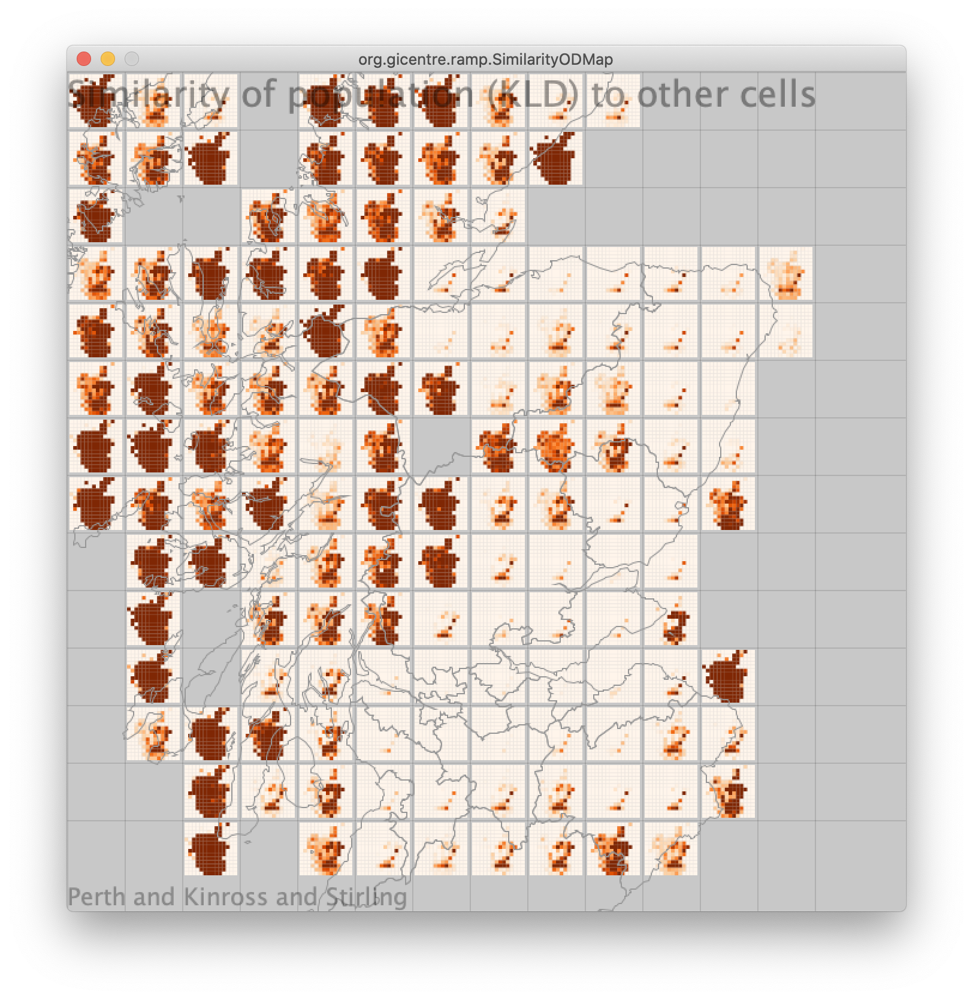

# Meeting notes 

## 24th January 2021 

Richard sent a suitable Kullback–Leibler Divergence formula. I implemented it and sent a screenshot.  

Not send the modified app yet, but emailed: 

> A screenshot attached. An obvious thing to note is that the darker the colour, the less similar (opposite to the correlation ones). Also worth pointing out that with few data point (the ones in the sea) are dark - I need to exclude or fade these out somehow. 

## 22th January 2021 

Presented prototype RAMP_SimilarityODMap-v1.2 

Positive feedback. 

Aidan: not sure if correlation is the right measure (one would expect pretty much everywhere to be correlated. Richard: correlation works well. But should also try the other diversity measure Kullback–Leibler divergence. 

Need to have indication of number of data points. 

Aidan: Would also like to apply to biodiversity measures with Claire/Richard’s help 

Richard/Claire to have a play about with the prototype. 

 

Proportion of population in the different age groups 

 

 

Difference in proportion of population in the different age groups compared to mouseovered cell (outlined in red and shown on map in bottom right). 

 

 

Population correction compared to mouseovered cell (outlined in red and shown on map in bottom right). 

 

 

OD map of population correlation 

 

OD map of population correlation with different zoom level for Ds. 

 

 

15th January 2021 

Kick-off for RAMP visualisation work (officially from February) 

Aidan: Types of work we could work on for this project 

Explore inputs - OD map 

- Movement data 

- Local movement 

- Diversity 

Explore how model works 

spread by movement 

spread by distance 

Comparison of model outputs 

keeping certain agegroups inside 

pollution 

areas that respond in the same ways 

Comparisons on the same way 

Richard: Similarity of populations 

Richard: Use correlation coefficients. Aidan: try different measure of similarity 

Aidan: OD maps for flows, would work with any spatial interaction measure, e.g. similarity 

Richard: experiment with different extents of origin and destination – e.g. similarity in zoom-in areas to whole of Scotland.  

Aidan: Plan 

Implement OD maps to show similarity (using correlation) and with the possibility of different zoom for origins and destinations. 

 

 