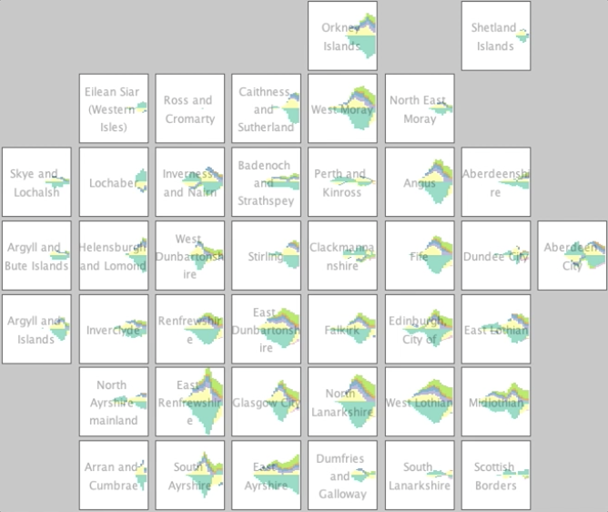
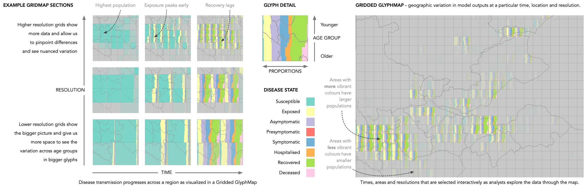

# Interactive visualisation that uses of Glyphmaps for population and COVID modelling

[This information is also] here(http://www.staff.city.ac.uk/~sbbb717/">http://www.staff.city.ac.uk/~sbbb717/)

This is joint work a [Claire Harris](https://www.bioss.ac.uk/people/claire.html") of [BIOSS](http://bioss.ac.uk) and [Richard Reeve](https://www.gla.ac.uk/researchinstitutes/bahcm/staff/richardreeve/) of [Glasgow University](https://www.gla.ac.uk/"). It was carried out as part of the [RAMPVIS](https://sites.google.com/view/rampvis/) - outputs of which are [published here](https://openaccess.city.ac.uk/id/eprint/28123/) (including outputs of this work) -  funded by EPSRC, involving most UK visualisation academics in a project coordinated by [Min Chen](https://eng.ox.ac.uk/people/min-chen/)</a> at [Oxford University](https://www.ox.ac.uk/)

The work used glyphmaps to help tune and interpret the spread of COVID through the Scottish population. However, please note that the model never developed to the stage of informing pandemic response and the results should be treated as **examples of what are possible**.

* **[Observable page](https://observablehq.com/@aidans/rampvis-idiom-gridded-glyphmaps)** that describes the work
* **[Observable page](https://observablehq.com/@aidans/zoomable-gridded-glyphmap-of-scottish-population)** with a simple implementation for age-banded Scottish population.
* **[Java implementation](https://www.staff.city.ac.uk/~sbbb717/glyphmaps/covid/RAMP_DemographicGridmap-v1.10_withdata.zip)** which implements the 4 glyph designs below.

## Zoomable Gridded Glyphmaps

Zoomable Gridded Glyphmaps dynamically grids spatial data with a fixed screen-size. This enables data to explored at multiple scales. Glyphs placed in cells summarise the data using a glyph. A wide range of glyph designs is possible, which can provide rich summaries that may include multiclass classes, multivariate data and statistical summaries.

In the table below, we provide 4 glyph types (rows) and 3 scaling types (columns).

<table>
<tr><td width=200></td><td style="text-align:center" width=150><b>Absolute</b> <i>Raw numbers of people</i></td><td style="text-align:center" width=150><b>Relative</b> <i>Proportions</i></td><td style="text-align:center" width=150><b>Relative with low populations deemphasised</b> <i>Low populations deemphasised through fading</i></td></tr>
<tr valign="top"><td style="text-align:right"><b>(Inverted) population pyramids</b> <i>Resident population in 10-year age-bands with the youngest at the top.</i></td><td></td><td></td><td></td></tr>
<tr valign="top"><td style="text-align:right"><b>Animated COVID spread over time</b> <i></i></td><td></td><td></td><td></td><td valign="bottom"></td></tr>
<tr valign="top"><td style="text-align:right"><b>COVID spread over time</b> </td><td></td><td></td><td></td><td valign="bottom"></td></tr>
<tr valign="top"><td style="text-align:right"><b>Comparison of COVID spread</b> <i>Compared to another scenario, with more above the horizontal centre and less below the horizontal centre</i></td><td></td><td></td><td></td><td valign="bottom"></td></tr>
</table>

In the map below, note the younger populations in the centres of Edinburgh and Glasgow.

## Gridmap Glyphmaps

Here, instead dynamically gridding the data, gridmaps present the data in existing administrative units (Local Authorities here) in a layout which tries to maintain good relative geographical positioning whilst maintaining large non-overlapping cells are large enough to resolve a detailed glyph.

 

On the right (above), the temporal reference line indicates, for example, that that infection starts sooner in Glasgow that in Edinburgh.

<table>
<tr><td width=200></td><td style="text-align:center" width=150><b>Absolute</b> <i>Raw numbers of people</i></td><td style="text-align:center" width=150><b>Relative</b> <i>Proportions</i></td><td style="text-align:center" width=150><b>Relative with low populations deemphasised</b> <i>Low populations deemphasised through fading</i></td></tr>
<tr valign="top"><td style="text-align:right"><b>(Inverted) population pyramids</b> <i>Resident population in 10-year age-bands with the youngest at the top.</i></td><td></td><td></td><td></td></tr>
<tr valign="top"><td style="text-align:right"><b>Animated COVID spread over time</b> <i></i></td><td></td><td></td><td></td><td valign="bottom"></td></tr>
<tr valign="top"><td style="text-align:right"><b>COVID spread over time</b> </td><td></td><td></td><td></td><td valign="bottom"></td></tr>
<tr valign="top"><td style="text-align:right"><b>Comparison of COVID spread</b> <i>Compared to another scenario, with more above the horizontal centre and less below the horizontal centre</i></td><td></td><td></td><td></td><td valign="bottom"></td></tr>
</table>

The image should help interpret the graphics (thanks to Jason Dykes for his input into this image).</i>

